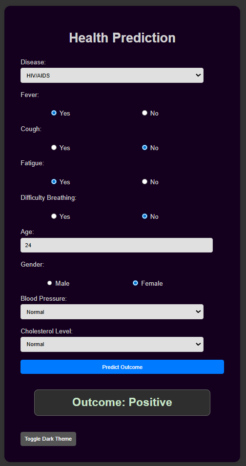

# Machine Learning Disease Prediction

A small Flask web app that predicts a suspected disease outcome based on patient symptom profile and health indicators. The model is trained with a Random Forest classifier on the `disease_symptoms_and_patient_profile_dataset.csv` dataset.

## Demo



## Project Structure

- `disease_symptoms_and_patient_profile_dataset.csv`: local dataset with symptoms, demographics, vitals, and outcome label.
- `requirements.txt`: required Python dependencies.
- `src/model.py`: trains the model and saves `model.pkl` and `encoders.pkl`.
- `src/app.py`: Flask app serving the UI and prediction endpoint.
- `src/static/`: frontend scripts and styles.
- `src/templates/index.html`: form UI for inputs.
- `assets/image.png`: demo screenshot embedded below.

## ML Workflow (Dataset -> Random Forest)

1. Load dataset:
   - `src/model.py` uses `pandas.read_csv("../disease_symptoms_and_patient_profile_dataset.csv")`.
2. Preprocess:
   - Label encode categorical features: `Disease`, `Fever`, `Cough`, `Fatigue`, `Difficulty Breathing`, `Gender`, `Blood Pressure`, `Cholesterol Level`.
   - Extract features (`X`) from all columns except `Outcome Variable`, target (`Y`) is `Outcome Variable`.
3. Train/test split:
   - `train_test_split(X, Y, test_size=0.15, random_state=0)`.
4. Random Forest training:
   - `RandomForestClassifier(max_leaf_nodes=60, n_estimators=12, random_state=0)` fit on training set.
5. Persist model and encoders:
   - Save `model.pkl` and `encoders.pkl` with `pickle.dump`.

## How Prediction Works

- User submits UI form with symptom values, age, gender, blood pressure, cholesterol.
- `app.py` loads saved `model.pkl` and `encoders.pkl`.
- Input values are encoded with matching `LabelEncoder` objects.
- Prediction made with `rf_model.predict`, and displayed on page.

## Run Locally

```bash
# from project root
python -m venv .venv
.venv\Scripts\activate
pip install -r requirements.txt

# train model (if not already trained)
cd src
python model.py

# run web app
python app.py
```

Open `http://127.0.0.1:5000` in browser.

## Notes

- If the path to `disease_symptoms_and_patient_profile_dataset.csv` changes, update `src/model.py` accordingly.
- Tuning `RandomForestClassifier` hyperparameters and adding validation metrics is recommended for production.
